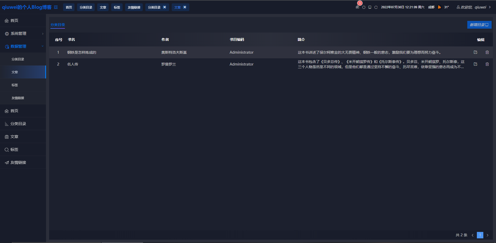

# Vue 3 + Vite + Blog

This template should help get you started developing with Vue 3 in Vite. The template uses Vue 3 `<script setup>` SFCs,
check out the [script setup docs](https://v3.vuejs.org/api/sfc-script-setup.html#sfc-script-setup) to learn more.

## Recommended IDE Setup

- [VSCode](https://code.visualstudio.com/)
    + [Volar](https://marketplace.visualstudio.com/items?itemName=johnsoncodehk.volar)

## 命令

- yarn dev
- yarn build

### mock

- yarn dev:mock
- yarn build:mock

### 登录

### 首页

### 分类目录

### 后台管理

### 浅色主题

### 自定义公共组件

- table
  ~~~
  /**
  *@handleCurrentChange : 翻页
  *@selectId : 选中id返回
  */
  <Table :list="list" @handleCurrentChange="user.handleCurrentChange" @selectId="user.selectId">
    <template v-slot:rightTitle="{item}">标题</template>
    <template v-slot:rightBtn="{item}">内容</template>
  </Table>
  
  list: {
    name: 'role',//组件类名,确定翻页滚动条重置
    header: [
      {name: "序号", width: "10%", key: 'i_num', color: '#1f2d3d',rang:true},//rang:true开启排序
      {name: "名称", width: "57%", key: 'name', color: '#1f2d3d'}
    ], //表名
    rows: [
      {
        i_num: 1,
        device: 136.1,
        level: 1.1,
        main: "pm2.5",
        value: 123,
        address: 49.3,
        timeS: "2021-01-04 00:00:00",
      },
    ], // 表数据
    page: 1,
    size: 20,
    total: 100,
    currentPage: 1,
    select: {
      open: false,           // 是否开启多项选中
      selectAll: false,      //全选
      isIndeterminate: false,// 中间状态
      selectId: []           // 选中ID
    },
  },
  ~~~

- popup
  ~~~
  /**
  *info : 弹框数据
  *@hide : 关闭弹框触发
  *高度最高80vh出现滚动条,如不使用可固定内层div高度
  */
   <popup :info="user.info" @hide="user.info.show = false">
      <template v-slot:title>
        用户
      </template>
      <template v-slot:main>
        
juese

      </template>
    </popup>
  
  info: {
    show: false,//显示
    name: 'role-pop',//弹框名
    w: '640px'//宽度
  },
  ~~~

- point
   ~~~
   /**
    *data : 弹框数据
    *@backPoint : 选点返回数据
    *point:打开绘制点数据
    */
   <Point :data="{show:state.pointMap,point:'104.044894,30.584891'}" @backPoint="state.backPoint"></Point>
   ~~~

- Jointlevel
  ~~~
   /**
    *roleMenusInfo : 多选数据 (支持4级)
    *@checkId : 选中数据返回
    */
   <Jointlevel @checkId="roleMenusInfo.checkId" :data="roleMenusInfo"></Jointlevel>
  
  roleMenusInfo: {
    name: '',             // 组件名
    list: [
            {name:'',id:'',child:[]}
          ],              // 数据
    checkId: [],          // 选中id
    key: 'name',          // 展示名称key
    value: 'id',          // 取值key
    child: 'child'        // 子集key
  },
  ~~~